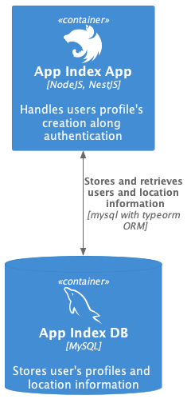

# app-index
Lucky code challenge

<p align="center">
  
</p>

You can find the model C4 script [here](docs/system.puml).

### Overview:
This project manages a set of users and stores their profiles with location information, providing a basic auth with username and password as well a protected endpoint using a JWT access token.

In detail I have used:
* `docker` to containerize applications
* JWT and basic authentication using `passport`
* MySQL DB with migrations and seeding using `typeorm` without using the repository pattern but using the `queryRunner` instead
* Testing with `jest`
* No cache layer implemented (but can be done, at first glance, with the [built-in cache manager of NestJS](https://docs.nestjs.com/techniques/caching).
* Validation pipes using `class-validator`
* Custom error and exceptions handling
* API docs are not generated automatically but stored in a markdown file manually (altough can be done using `swagger` with `openapi`)

## Running the app

In order to execute the application you must:

1. Create a `.env` file in the root of the project folder with the next content:
```
##########
# app-index application setup
##########
NODE_ENV=
JWT_SECRET=

##########
# mysql database configuration
##########
DATABASE_HOST=
DATABASE_USERNAME=
DATABASE_PASSWORD=
DATABASE_NAME=
DATABASE_PORT=
```
The example environment file (`.env.dist`) contains the development environment variables, so you can copy and paste them in the `.env` you just created.

2. Having `docker compose` installed, launch the application and database containers from the root folder:

```bash
# Build app image
$ docker compose -f .docker/compose.yaml build
# Build db image and start both containers
$ docker compose -f .docker/compose.yaml up -d
```

Two docker images will be created: a mysql database and a containerized application (it might take some time while the migrations are executed, so please check the logs in the `app` container to know the progress of the project launching). 
We encourage that any command that is intended to be executed in the application **should** be executed inside the container `app`. The database container can be accessed (see below) as well using the container `db`.

And that's it! You can test the server and the database are running by pinging to the application status endpoint:
```bash
$ curl http://localhost:3110/app/status
```

Notes:
* Migrations and seeding are run once the `app` container is launched
* The default exposed port for the `app` is 3110 and `db` is 2401

## Available endpoints and preset values

You can find the list of endpoints available and the data that is already in the database to use with these endpoints in this [section](/docs/api.md).

## Developing
In order to improve the developer experience when working on this project, is created a `dev` docker image that enables live reloading. To use it, create a `.env` file inside the `./docker` folder setting the environment variable `BUILD_TARGET` to `dev` (set by default to `release`):
```
BUILD_TARGET=dev
```

## Manipulating the database

This project uses `typeorm` for database manipulation. Any command related to it must be executed inside the container as follows:

```bash
# Execute migrations
$ docker exec -it app npx typeorm migration:run -d dist/src/database/data-source.js

# Revert last migration
$ docker exec -it app npx typeorm migration:revert -d dist/src/database/data-source.js
```

Any command is executed in the context of the data source configuration in `dist/src/database/data-source.js`. 

You can access the containerized database as well by doing: `docker exec -it db /bin/sh`. This will prompts to you a sh command line utility where you can access the MySQL CLI by doing `mysql -u root -p` or you can use any Database UI client of your preference by connecting with the credentials given in the project `.env` file.

The credentials and username for the database can be found and changed (according of how is created the database container) inside the `.env` file.

## Testing

This project comes with a set of unit tests you can check by doing `docker exec -it app npm run test` (this is executing the `npm run test` command inside the app container).

Note:
Altough this command can be executed outside the container, due to the bcrypt library OS installation, the executing outside the container is not available.

## License

Nest is [MIT licensed](LICENSE).
